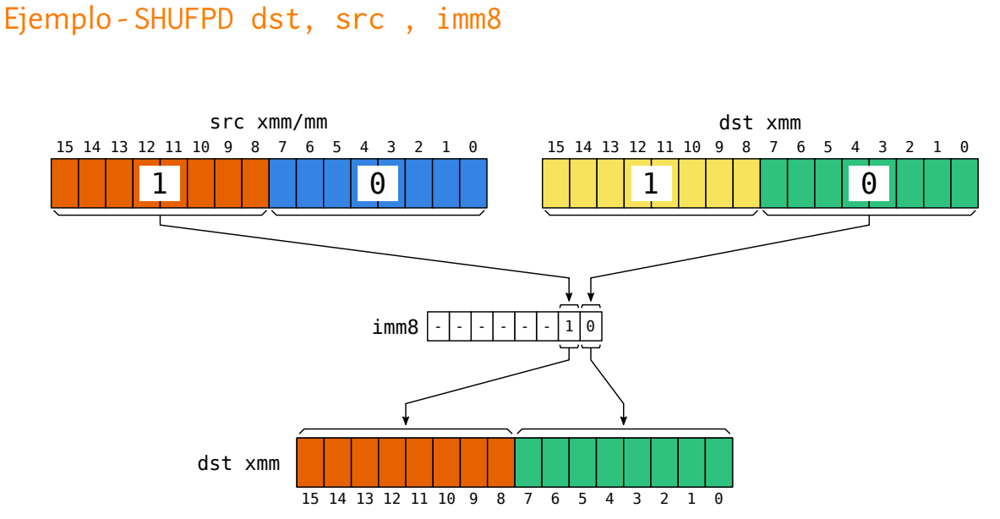

# Convención de llamada linux x86_64

## Parámetros y valores de retorno 64 bits

- **Enteros y punteros**: RDI, RSI, RDX, RCX, R8, R9
- **Flotantes**: XMM0, ... , XMM7
- **Retorno**: RAX, XMM0
- **Temporales**: RAX, R10, R11, XMM8, ..., XMM15, st2, ..., st7, k0, ..., k7
- **long doubles (temporales)**: st0, st1

 **No volatiles**: RBX, RBP, R12, R13, R14, R15

Las funcioens llamadas si quieren modificar registros no volatiles tienen la obligación (por convención) de restaurarlos al terminar.

Los parametros que entran por registros se pasan de izquierda a derecha. Los que no alcanzan a entrar, se pasan por stack de derecha a izquierda (viendolo desde la declaración de la función).

Para llamadas a funciones de C, se necesita la pila alineada a 16 bytes (en 32 bits también)

## Parámetros y valores de retorno 32 bits

- Todos los parámetros se pasan por pila (de derecha a izquierda)
- **Retorno**: EAX
- **No volatiles**: EBX, EBP, ESI, EDI

## Modos de acceso a memoria
- [ inmediato ]
- [ registro ]
- [ registro + registro*escala ] siendo escala 1, 2, 4 u 8
- [ registro + inmediato ]
- [ reg + reg*escala + inm ]

## Alineación de structs
- Cada variable debe estar alineada a una pocisión multiplo de su tamaño.
- El tamaño de la estructura debe estar alineado al tamaño del atributo más grande
- En ambos casos se agrega padding para rellenar ( se puede sacar con **\_\_attribute\_\_((_\_packed_\_))**)

{ width=50% }

## Interacción con C
- Las funciones exportadas se deben declarar en la sección .text con ***global func***
- Las funciones de C llamadas desde ASM se deben declararen .text con ***extern func***

## Secciones del código
- **.data**: variables globales inicializadas (DB: define byte, DW: word, DD: double word, DQ: quad word)
- **.rodata**: constantes globales inicializadas (DB, DW, DD, DQ)
- **.bss**: variables globales no inicializadas (RESB, RESW, RESD, RESQ) (reserve)
- **.text**: codigo

Dentro de *.text* la etiqueta _start sería el equivalente a la función *main*   

Para ensamblar un mismo valor repetido:  
*"etiqueta"* **times** *"numero"* DB/BW/DD/DQ *"hexa/entero/binario/octal"*  

En general las instrucciones son registro-registro; registro-memoria; registro-inmediato; memoria-registro; memoria-inmediato

# SIMD
## MOV xmm-m m-r
{ width=75% }

## Packed MOV xmm-xmm xmm-m

{ width=75% }

{width=50%}
{width=50%}

## Packed operaciones aritmeticas xmm-xmm xmm-m
{ width=60% } 

Notar que pmul tiene low y high, con low se guarda el resultado de la parte baja o alta (al multiplicar en el peor caso se necesita el doble de bits)

{ width=50% }

{ width=40% }

## Packed operaciones fp xmm-xmm xmm-m
{ width=75% }

{ width=75% }

## Packed operaciones saturadas con enteros xmm-xmm xmm-m
{ width=50% }

## Packed operaciones horizontales xmm-xmm xmm-m
{ width=90% }

## Packed operaciones lógicas y shifts xmm-xmm xmm-m
{ width=90% }

## Packed compare enteros y flotantes xmm-xmm xmm-m
{ width=90% }

{ width=50% }

{ width=90% }

## Desenpaquetado 
Notar que hay para tomar los lows y highs

{ width=75% }

## Shuffles xmm-xmm xmm-m128
{ width=75% }

Las máscaras negativas dejan en 0 el paquete

### packed shuffle bytes xmm-xmm-imm8 xmm-m128-imm8

{ width=50% }

### packed shuffle low words xmm-xmm-imm8 xmm-m128-imm8
{ width=50% }

### packed shuffle high words xmm-xmm-imm8 xmm-m128-imm8

{ width=50% }

### packed shuffle double words xmm-xmm-imm8 xmm-m128-imm8

{ width=50% }

### shuffle singles floating points xmm-xmm-imm8 xmm-m128-imm8

{ width=50% }

### shuffle doubles floating points xmm-xmm-imm8 xmm-m128-imm8

{ width=50% }

## Insert y extract
{ width=75% }

### Insert Packed Single Precision floating point xmm-xmm-i, r-m32-imm8
El inmediato me indica en "dst" el lugar en donde se copiará el punto flotante, "src" cuál elemento del xmm src se copia (si es memoria de 32 bits, se ignora ya que solo hay una cosa para copiar) y el "zmask" indica que bloques poner en 0. Los bloques que no se escriben se mantienen como estaban.   

{ width=50% }

{ width=50% }

### Extract Packed Single Precision floating point r32/r64/m32-xmm-imm8
Si recibe un registro de 64 bits, pone en 0 los demas bits

{ width=50% }

### Packed Insert Byte/Word/Dword/Qword xmm-r/m8/16/32/64-imm8
Se inserta en el registro xmm un byte/word/dword/qword del registro o memoria del src en la pocisión especificada por el inmediato

{ width=50% }
{ width=50% }
{ width=50% }
{ width=50% }

### Packed Extract Byte/Word/Dword/Qword r/m8/16/32/64-xmm-imm8
Toma el byte/word/dword/qwrod del bloque especificado por el inmediato del registro xmm y lo pone en el registro o momeria. Para los registros, los bits restantes los pone en 0. 

{ width=50% }
{ width=50% }
{ width=50% }
{ width=50% }

## Blend (mezclar registros)

{ width=75% }

### Blend Packed SP y DP xmm-xmm/m128-imm8
El inmediato sirve para ir eligiendo de que registro elegir. Cada bit representa un bloque en el destino, si vale 0 se elige del "dst", si es 1 se elige de "src".

{ width=50% }
{ width=50% }

### Variable Blend Packed SP y DP xmm-xmm/m128-<xmm0>
Misma idea que el anterior pero se usa el registro xmm0 en vez de un inmediato, pero se fija en si el numero es positivo o negativo (el bit más significativo de cada bloque)

{ width=50% }
{ width=50% }

### Blend Packed Words/bytes xmm-xmm/m128-imm8
Misma idea de mezclar según el bit del bloque representado por el inmediato. Si es 1 se toma la word en dicha posición en "src" y 0 en "dst"

{ width=50% }
{ width=50% }

# Conversiones float-double/int-float y truncado

{ width=75% }

{ width=75% }

{ width=75% }

# Comandos utiles de gdb

| comando | descripcion  |
|----------|----------------------|
| b < archivo >:< linea > | pone un break en el archivo y linea especificada|
|  |  |
| info breaks | lista todos los breakpoints |
|  |  |
| delete n | elimina el breakpoint n |
|  |  |
| r | corre el programa |
|  |  |
| n | ejecuta la siguiente linea |
|  |  |
| c | continua la ejecución |
|  |  |
| gdb --args < archivo > arg1 arg2 arg3 | ejecuta el archivo pasandole argumentos |
|  |  |
| info registers < registro > | devuelve el valor del registro, podemos pasarle tambien los eflags |
|  |  |
| info locals | lista las variables del stack frame actual |
|  |  |
| info args | lista los argumentos del stack frame actual |
|  |  |
| backtrace | imprime el backtrace del stack entero |
|  |  |
| backtrace n | idem pero solo los n ultimos stack frames |
|  |  |
| backtrace -n | idem pero los primeros n stack frames |
|  |  |
| backtrace full | imprime el backtrace del stack entero con sus variables locales |
|  |  |
| up / up n | se mueve al stack frame superior (o n stack frames arriba) (para imprimir variables locales de otro stack frame si se quiciera) |
|  |  |
| down / down n | se mueve al stack frame inferior (o n stack frames abajo) |
|  |  |
| x < addr > | imprime el valor de memoria especificado por la dirección addr |
|  |  |
| x/nfu < addr > | idem pero puedo especificar la cantidad n de bloques en unidad "u" a imprimir; el formato f; la unidad u que puede ser b (byte), h (halfword, 2 bytes), w (word 4 bytes), g (giant words, 8 bytes). [mas info](https://sourceware.org/gdb/onlinedocs/gdb/Memory.html) | 
|  |  |
| print < expresion > | imprime el valor de la expresión |
|  |  |
| print /f < expresion > | idem con el formato especificado |
|  |  |
| display < expresion > | habilita la impresión automática por cada paso del debuger |
|  |  |
| display/f < expresion > | idem con el formato especificado |
|  |  |
| undisplay < expresion > | deshabilita la impresión automática de la expresión |
|  |  |

### formatos
- o: octal
- x: hexadecimal
- d: decimal
- u: unsigned decimal
- t: binary
- f: floating point
- a: address
- c: char
- s: string
- i: instruction