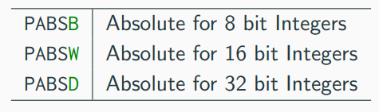

# Convención de llamada linux x86_64

## Parámetros y valores de retorno 64 bits

- **Enteros y punteros**: RDI, RSI, RDX, RCX, R8, R9
- **Flotantes**: XMM0, ... , XMM7
- **Retorno**: RAX, XMM0
- **Temporales**: RAX, R10, R11, XMM8, ..., XMM15, st2, ..., st7, k0, ..., k7
- **long doubles (temporales)**: st0, st1

 **No volatiles**: RBX, RBP, R12, R13, R14, R15

Las funcioens llamadas si quieren modificar registros no volatiles tienen la obligación (por convención) de restaurarlos al terminar.

Los parametros que entran por registros se pasan de izquierda a derecha. Los que no alcanzan a entrar, se pasan por stack de derecha a izquierda (viendolo desde la declaración de la función).

Para llamadas a funciones de C, se necesita la pila alineada a 16 bytes (en 32 bits también)

## Parámetros y valores de retorno 32 bits

- Todos los parámetros se pasan por pila (de derecha a izquierda)
- **Retorno**: EAX
- **No volatiles**: EBX, EBP, ESI, EDI

## Modos de acceso a memoria
- [ inmediato ]
- [ registro ]
- [ registro + registro*escala ] siendo escala 1, 2, 4 u 8
- [ registro + inmediato ]
- [ reg + reg*escala + inm ]

## Alineación de structs
- Cada variable debe estar alineada a una pocisión multiplo de su tamaño.
- El tamaño de la estructura debe estar alineado al tamaño del atributo más grande
- En ambos casos se agrega padding para rellenar ( se puede sacar con **\_\_attribute\_\_((_\_packed_\_))**)

{ width=50% }

## Interacción con C
- Las funciones exportadas se deben declarar en la sección .text con ***global func***
- Las funciones de C llamadas desde ASM se deben declararen .text con ***extern func***

## Secciones del código
- **.data**: variables globales inicializadas (DB: define byte, DW: word, DD: double word, DQ: quad word)
- **.rodata**: constantes globales inicializadas (DB, DW, DD, DQ)
- **.bss**: variables globales no inicializadas (RESB, RESW, RESD, RESQ) (reserve)
- **.text**: codigo

Dentro de *.text* la etiqueta _start sería el equivalente a la función *main*   

Para ensamblar un mismo valor repetido:  
*"etiqueta"* **times** *"numero"* DB/BW/DD/DQ *"hexa/entero/binario/octal"*  

En general las instrucciones son registro-registro; registro-memoria; registro-inmediato; memoria-registro; memoria-inmediato

# SIMD
## MOV r-m m-r
{ width=75% }

## Packed MOV r-r r-m

{ width=75% }

{width=50%}
{width=50%}

## Packed operaciones aritmeticas r-r r-m
{ width=60% } 

Notar que pmul tiene low y high, con low se guarda el resultado de la parte baja o alta (al multiplicar en el peor caso se necesita el doble de bits)

{ width=50% }

{ width=40% }

## Packed operaciones fp r-r r-m
{ width=75% }

{ width=75% }

## Packed operaciones saturadas con enteros r-r r-m
{ width=50% }

## Packed operaciones horizontales r-r r-m
{ width=90% }

## Packed operaciones lógicas y shifts r-r r-m
{ width=90% }

## Packed compare enteros y flotantes r-r r-m
{ width=90% }

{ width=50% }

{ width=90% }

## Desenpaquetado 
Notar que hay para tomar los lows y highs

{ width=75% }