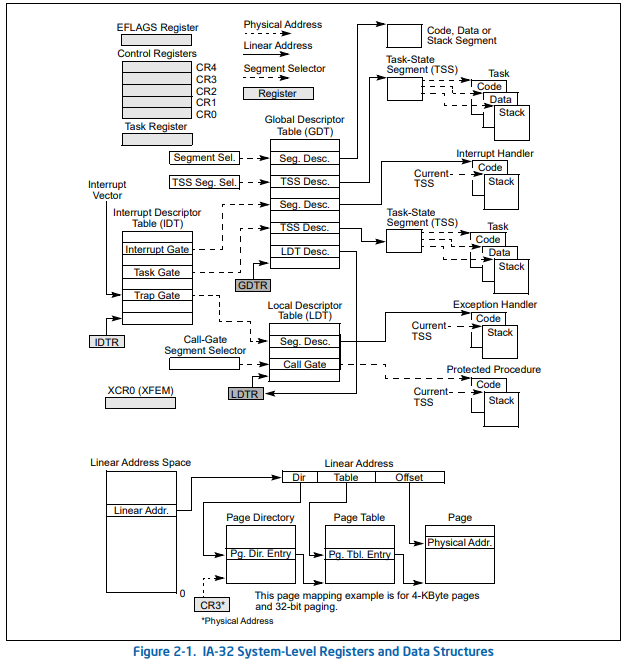


### Modo real
- Trabaja con 16 bits
- 1MB de memoria
- No hay protección ni privilegios en memoria

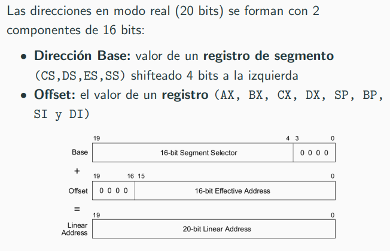{width=70%}

Ejemplo: *Dirección Física = Segmento * 16 + Offset*
Segmento = 0x12F3. Offset = 0x4B27

0x17A57 = 0x12F30 + 0x4B27

### Modo protegido
- 32/64 bits
- 4GB de memoria para 32 bits
- 4 niveles de privilegio, atención a interrupciones con privilegio.

# Segmentación

- **Linear Address space**: memoria direccionable por el procesador. Generalmente se divide en segmentos.
- **Dirección lógica**: Consiste en un **selector de segmento** y un **offset**, y sirve para direccionar a un byte dentro de un segmento.
  - **Segment selector**: Es un identificador único para un segmento en un descriptor table (por ejemplo la GDT, Global Descriptor Table) que dá a lugar a un descriptor de segmento. Consiste en un indice, un bit indicador (0 GDT, 1 LDT) y 2 bits para el privilegio.
  
  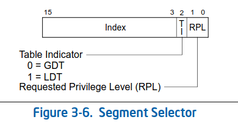{width=40%}

  - **Offset**: Se suma el offset con el base adress para obtener el byte deseado dentro del segmento. 
  
  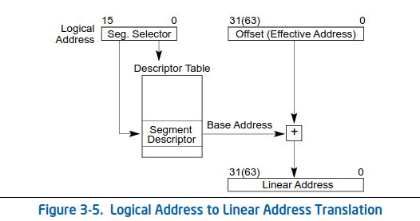{width=60%}


- Si no se usa paginación, la dirección lineal se mapea directamente con la dirección física (la linear se manda directo al bus). Si se usa paginación se hace una segunda traducción de dirección lineal a dirección física.

- **Segmentación Flat**: El sistema operativo y las aplicaciones tiene acceso a una memoria contigua, en general se usa un segmento para todo el espacio de direccionamiento de 4gb, se define uno para datos de nivel 0 y 3, y codigo de nivel 0 y 3 que se solapan. Con esto se esconde la segmentación.
  
- **GDTR (Global Descriptor Table Register)**: Consiste en un registro de 48 bits, los 32 mas significativos guarda la dirección de la GDT en el espacio de direccionamiento lineal. Los restantes 16 definen el limite en bytes de la tabla. Entonces máximo la tabla puede tener 2^16 / 2^3 (el tamaño de un **gate** de la gdt) = 2^13 = 8192 descriptores de segmento.
El byte limite se incluye en el tamaño, es decir que si el limite = 0, entonces la GDT tiene solo un byte de tamaño, por lo que el límite tiene que ser uno menos un múltiplo de 8 (8N - 1) para tener al menos una entry.

Se carga con la instrucción lgdt [mem], que recibe una dirección en la que toma 48 bits

- **GDT**: Es un arreglo de descriptores de segmento global. El primer descriptor de la tabla no se usa (*Null descriptor*). Cuando un registro  de segmento (DS, ES, FS, GS) carga el segmento nulo no genera una excepción, pero cuando se intenta acceder se genera un #GP (general-purpuse exception).


- **Segment descriptor**: Especifica el tamaño, los permisos y los privilegios, el tipo, la ubicación del primer byte en la linear address space del segmento (**base adress**).

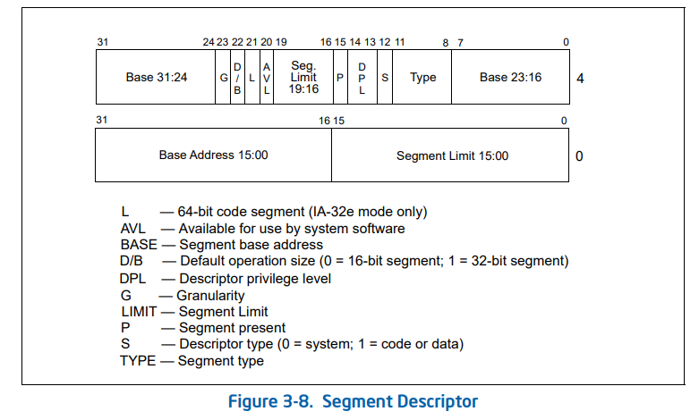{width=70%}

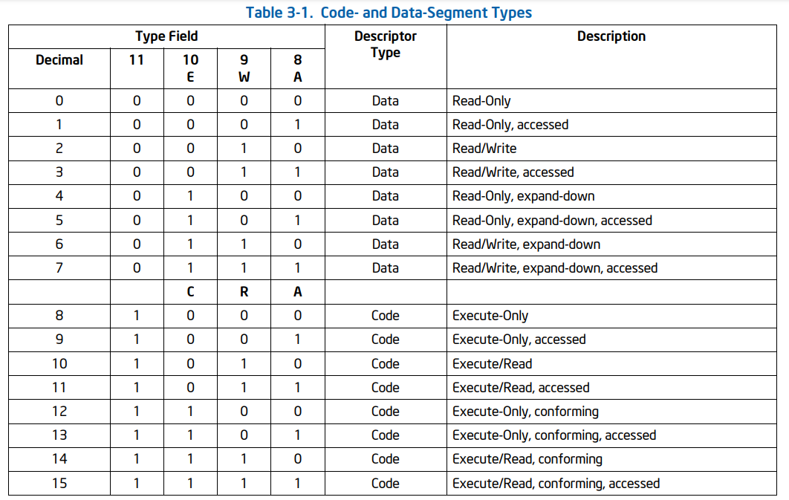{width=80%}

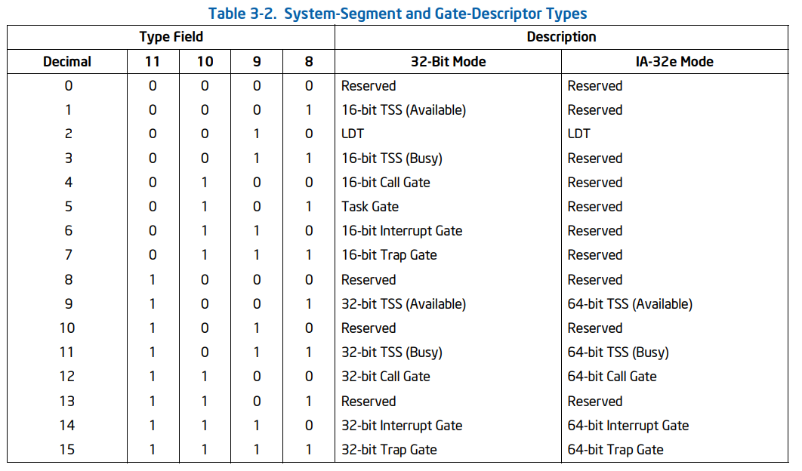{width=80%}

- **Registros segmento**: guardan las ultimas traducciones hechas de direcciones lineales. Es decir que solo pueden usarse hasta 6 segmentos a la vez. Se modifican con un jmp far, mov y otras instrucciones. CS: codigo, SS: stack, el resto datos.

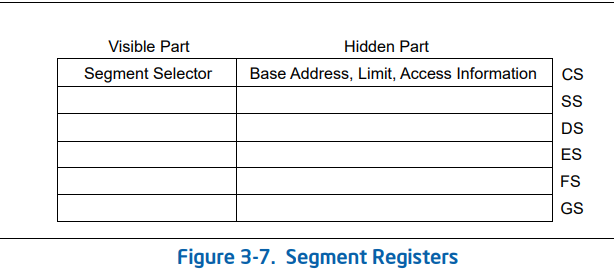{width=50%}

# Interrupciones 

- Se define una identidad numérica para cada interrupción (vectorización) y utiliza una tabla de descriptores
donde para cada índice, o identidad, se decide:
  - Donde se encuentra la rutina que lo atiende (dirección de memoria)
  - En qué contexto se va a ejecutar (segmento y nivel de privilegio).
  - De qué tipo de interrupción se trata

### **Tipos de interrupciones**
  - Excepciones que van a ser generadas por el procesador cuando se cumpla una condición, por ejemplo si se quiere acceder a una dirección de memoria a través de un selector cuyo segmento tiene el bit P apagado.
    - *Fault*: Excepción que podría corregirse para que el programa continúe su ejecución. El procesador guarda en la pila la dirección de la instrucción que produjo la falla. Algunos faults suman un código de error a la pila.
    - *Traps*: Excepción producida al terminar la ejecución de una instrucción de trap. El procesador guarda en la pila la dirección de la instrucción a ejecutarse luego de la que causó el trap.
    - Aborts: Excepción que no siempre puede determinar la instrucción que la causa, ni permite recuperar la ejecución de la tarea que la causó. Reporta errores severos de hardware o
    inconsistencias en tablas del sistema.

  - Interrupciones:
    - *Externas*: de un dispositivo externo (reloj o teclado)
    - *Internas*: generado por una llamada a la instrucción INT por parte de un proceso.

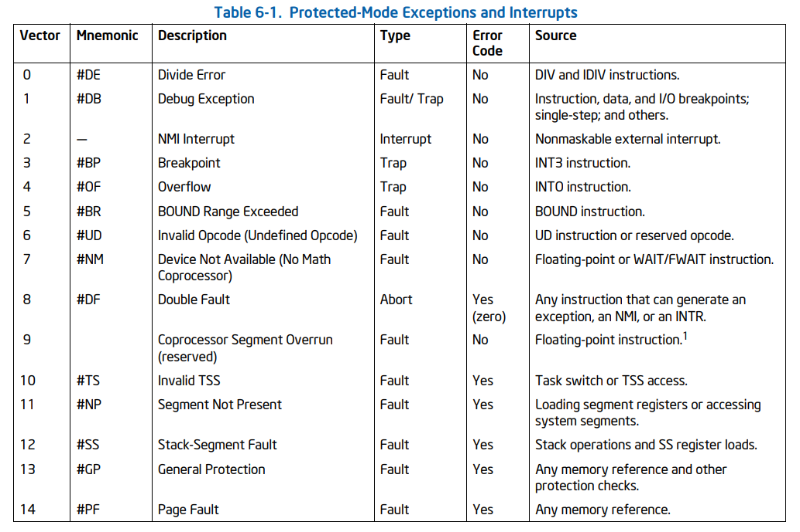{width=80%}

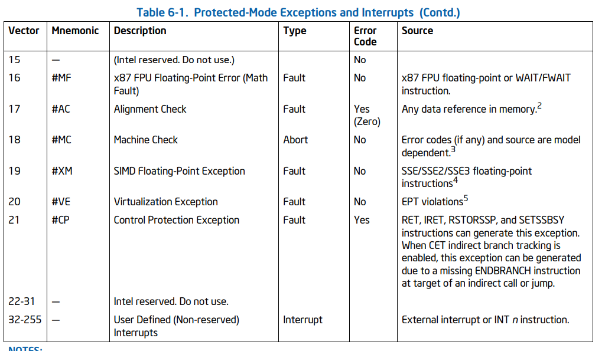{width=80%}

### **Atención a interrupciones**
Antes de la atención, el procesador pushea a la pila EFLAGS, CS, EIP y el codigo de error si hay según la interrupción.
Luego el handler hace IRET que saca de la pila los primeros 3 mencionados (el error code depende del programador poner en la posición correcta el esp, ya que algunas interrupciones no tienen error code).

Según si el handler de la interrupción tiene un privilegio mayor que la tarea ejecutandose al momento de producirse dicha interrupción, se puede generar un "cambio" de stack. Éste stack con mayor privilegio está definido en la TSS de dicha tarea.

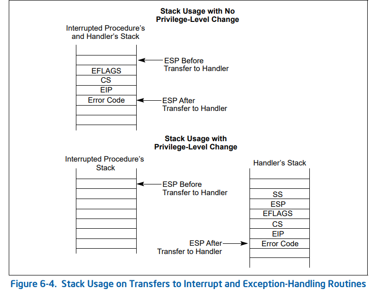{width=70%}

- La pila se alinea a 4 bytes (no en 16 como se hacia para la convención con C).

### Estructura de la IDT

Parecida a la GDT, guarda por cada interrupción posible (son 255. Pueden haber menos, se dejan el bit p en 0) se define en que segmento y offset (dentro del segmento) están los handlers, además de algunos atributos. 

Con lidt [mem] se carga el idtr. Consiste en 48 bits, el del base address indica la dirección de la IDT y el limite el tamaño en bytes.

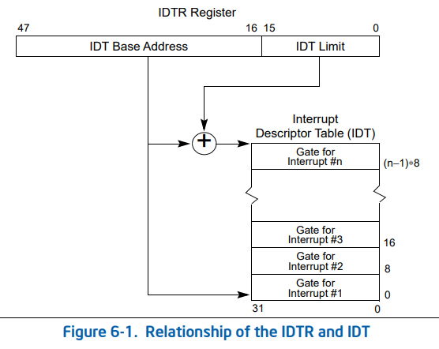{width=55%}

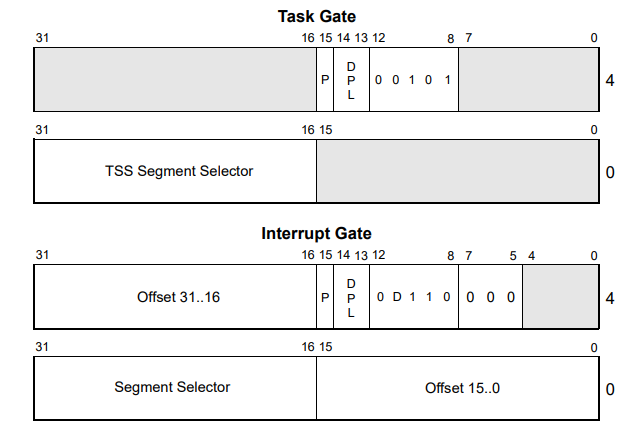{width=50%}
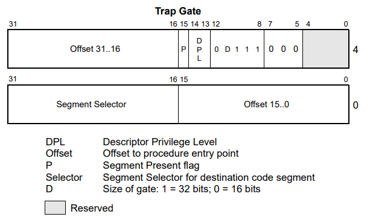{width=50%}

los bits 12 a 8 indican el type, ver tabla de gdt para types de sistema. El que usamos para interrupciones de 32 bits es el 1110

Se pueden implementar syscalls con interrupciones. Las syscalls es el mecanismo que se tiene para dar funcionamiento de nivel de privilegio alto para las aplicaciones de usuario de forma segura.

### PIC
Controlador que maneja las interrupciones externas. En un principio hay que configurarlo con un protocolo definido. Como los codigos de interrupciones se pisan con los del sistema, se debe hacer un remapeo.

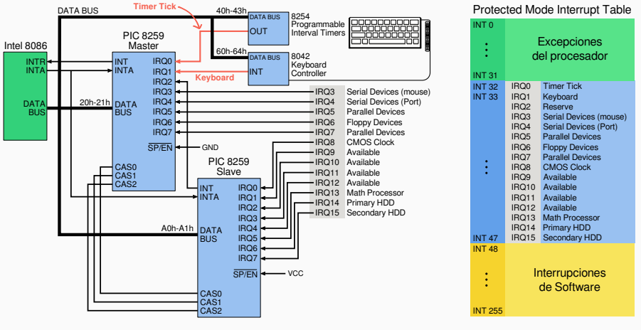{width=90%}

El mapeo lo hacemos para que las interrupcioens del PIC1 vayan del 32 al 39 (0x20-0x27) y del PIC2 del 40 al 47 (0x28-0x2F). Luego al PIC1 hay que decirle en que puerto tiene conectado el slave, como puede solo tener 8 posibilidades el numero se hace como visto en una tira de 8 bits en los que están prendidos los que tenga conectado otro PIC, ejemplo: 0b00000100 = 4 en el puerto 2 tiene un slave.

Al slave hay que pasarle a qué puerto pertenece, esté si corresponde al numero en decimal de el IRQ, en este caso 2 (IRQ2).

```C
#define PIC1_PORT 0x20
#define PIC2_PORT 0xA0
#define PIC1_DATA (PIC1_PORT+1)
#define PIC2_DATA (PIC2_PORT+1)

void pic_finish1(void) { outb(PIC1_PORT, 0x20); }
void pic_finish2(void) {
  outb(PIC1_PORT, 0x20);
  outb(PIC2_PORT, 0x20);
}

  // Inicializar el PIC
void pic_reset() {
  
  outb(PIC1_PORT, 0x11); // Initialization Command Word 1 (ICW1) (datos de inicializacion)
  outb(PIC2_PORT, 0x11); // idem
  outb(PIC1_DATA, 0x20); // ICW2: offset del PIC1 en el direccionamiento del puerto
  outb(PIC2_DATA, 0x28); // ICW2 offset del PIC2 en el direccionamiento del puerto
  
  
  outb(PIC1_DATA, 4); // ICW3 puerto donde está conectado el slave
  outb(PIC2_DATA, 2); // ICW3 identidad del slave, en este caso es 2 ya que esta conectado al IRQ2
  outb(PIC1_DATA, 0xFF); // ICW4: clear IMR
  outb(PIC2_DATA, 0x01); // ICW4

}

void pic_enable() {
  outb(PIC1_PORT + 1, 0x00);
  outb(PIC2_PORT + 1, 0x00);
}

void pic_disable() {
  outb(PIC1_PORT + 1, 0xFF);
  outb(PIC2_PORT + 1, 0xFF);
}
```

# Paginación
- Cada proceso tiene un direccionamiento virtual que se traduce a las direcciones físicas. Esto permite un manejo más eficiente de la memoria ya que los procesos se pueden abstraer de qué direcciones les corresponde realmente. 
- Para la traducción se usa la *dirección virtual* y las estructuras de paginación: *directorio de tablas y tabla de paginas*.
- La ubicación del directoria de páginas correspondiente al proceso actual se guarda en el registro CR3. 
- Se puede definir paginas de 4KB o 4MB.
- Para activar paginación se debe activar el bit CR0.PG

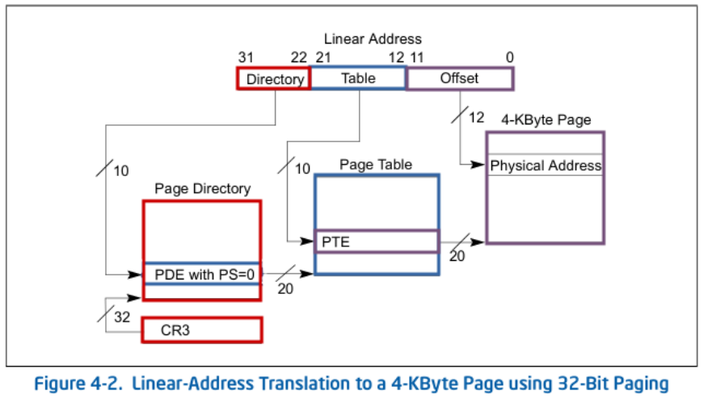{width=60%}

Con el CR3 se ubica el directorio de paginas; con los 10 bits más significativos de la dirección virtual se indexa dentro del directorio (obtenemos la dirección de la tabla de páginas); con los 10 bits siguientes se indexa en la tabla (obtenemos la dirección de la tabla); con los últimos 12 bits se indexa dentro de la página (obtenemos el byte buscado).

Las entradas del directorio y la tabla de páginas son descriptores de tablas y páginas respectivamente que guardan 20 bits de dirección (ya que los ultimos 12 estan en 0 porque una página ocupa 4KB = 2^12) y algunos atributos. Cada entry ocupa 4Bytes, por lo que hay 1024 entries = 2^10. Luego en la página hay 4KB = 2^12 de bytes direccionables.

*virt = dir(10bits) | table(10bits) | offset(12bits)*
```C
pd = CR3 & 0xFFFFF000
pd_index = (virt >> 22) & 0x3FF
pt = pd[pd_index] & 0xFFFFF000
pt_index = (virt >> 12) & 0x3FF
page_addr := pt[pt_index] & 0xFFFFF000
offset = virt & 0xFFF
phys = page_addr | offset
```

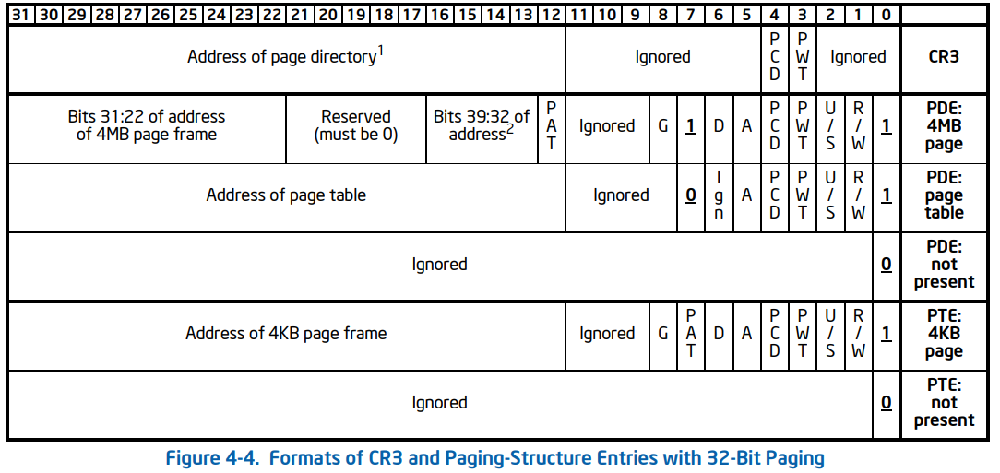{width=75%}


- PDE: page directory entry, PTE: page table entry
- PCD: Page-level cache disable
- PWT: Page-level write-through
- U/S: 0 Supervisor 1 User
- A: Accessed (si se usó para una traducción en caso de PDE y si SW accedió a la página en caso de PTE).
- D: Dirty si se escribió
- G: global, ignorado si CR4.PGE = 0
- R/W: Read/Write 1 o solo lectura en 0

### TLB
El procesador cuenta con una tabla de traducciones pre-computadas
(translation lookaside buffer), que almacena las últimas  traducciones realizadas para no tener que volver a
computarlas.
Cuando realicemos un cambio en nuestras estructuras de
paginación es necesario forzar una limpieza del mismo para evitar
que las direcciones pre-computadas que ya no son válidas se sigan
empleando, para esto realizamos un intercambio del registro CR3
con un valor temporal y luego lo restauramos. (tlbflush() definido por la cátedra, que es un mov a CR3)

### Page fault
El registro CR2 contiene la dirección lineal que la causó. Podemos definir un handler que reciba el valor de cr2 y luego se encargue de inicializar las estructuras necesarias para obtener la página pedida.

```asm
global _isr14

_isr14:
    pushad
    mov eax, cr2
    push eax
    ; devuelve true si pudo atenderla (creo la página), false sino
    call page_fault_handler
    ; saco el valor pusheado
    add esp, 4
    cmp al, TRUE
    je .fin
    .ring0_exception:
    ; Si llegamos hasta aca es que cometimos un page fault fuera del area compartida.
    call kernel_exception
    jmp $
    
    .fin:
    popad
    add esp, 4 ; error code
    iret

```

## Tareas
Una tarea es una unidad de trabajo que el procesador puede
despachar, ejecutar y supender. Puede ser usada para ejecutar un
programa. El scheduler se encarga de administrar que tarea ejecuta el procesador en cada tic del reloj. Dos tareas pueden tener el mismo código de programa pero tener contextos de ejecución distintos. Cada tarea va a tener:
- *Espacio de Ejecución*: Páginas mapeadas donde va
a tener el código, datos y pilas. Podes definir un page directory para cada tarea o compartir una entre varias.
- *Segmento de Estado (TSS)*: Una región de memoria que
almacen el estado de una tarea, a la espera de iniciarse o al
momento de ser desalojada del procesador, y con un formato
específico para que podamos iniciarla/reanudarla. Guarda los Registros de propósito general, Registros de segmento de la tarea y segmento de la pila de nivel 0, Flags y el CR3 correspondiente a la tarea.

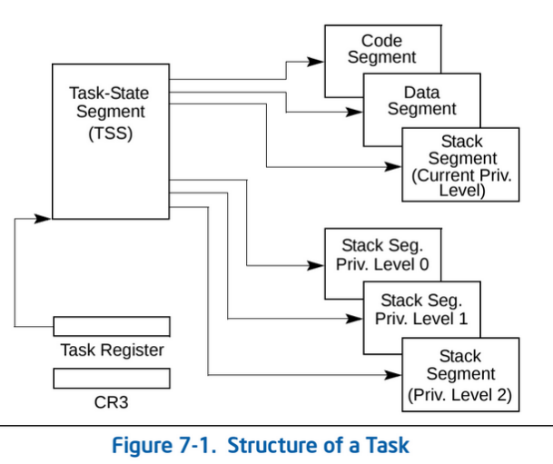{width=35%}

### Definición de tareas

Cada vez que se cambia de tarea se produce un cambio de contexto: se guarda la información de la tarea actual y se carga la de la próxima tarea a ejectuarse provista por el scheduler.

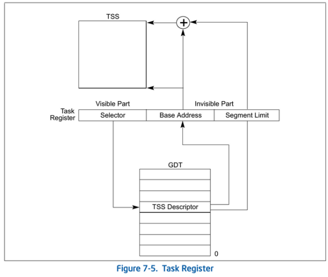{width=60%}

Las tareas se definen en la GDT, una task entry guarda la información necesaria para localizar la TSS de la tarea.

El task register guarda el selector de segmento de la GDT en donde se encuentra el TSS descriptor de la tarea actual.

Al crear una tarea hay que setear los valores iniciales de la TSS: eip, esp, ebp, esp0, cs, ds, es, fs, gs, ss, ss0, cr3, eflags (en 0x00000202)

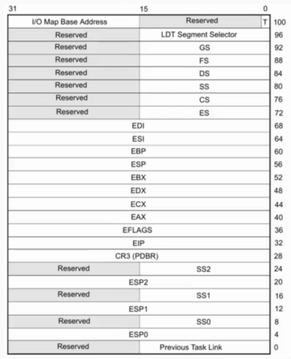{width=50%}

Cada tarea tiene su correspondiente entrada en la GDT

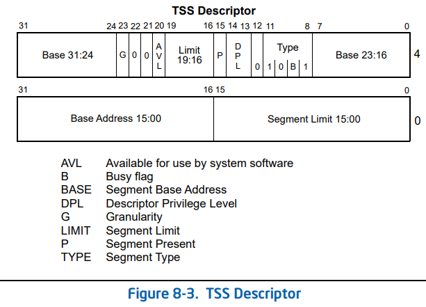{width=50%}

- *B (busy)*: indica si la tarea está siendo ejecutada, inicializamos en 0.

### Cambio de tareas
Consiste en hacer un jmp far selector_tarea:offset donde el offset es ignorado y puede ser cualquier numero

```asm
sched_task_offset: dd 0xFFFFFFFF
sched_task_selector: dw 0xFFFF

global _isr32
_isr32:
  pushad
  call pic_finish1
  ; devuelve el selector de la proxima tarea
  call sched_next_task

  ; str: store task register, guarda el valor de tr en cx
  str cx
  ; compara si no es el mismo segmento que la tarea siguiente dada por el scheduler
  cmp ax, cx
  je .fin
  ; ejecuta el cambio de contexto
  mov word [sched_task_selector], ax
  jmp far [sched_task_offset]
  .fin:
  popad
  iret

```

### Tarea inicial
El procesador tiene que estar siempre ejecutando una tarea, se definen la tarea inicial cómo la que se ejecuta cuando arranca el procesaor y la tarea idle como la tarea que ejecuta cuando no hay nada que hacer.
```asm
; carga en el tr el selector de segmento guardado en ax
; con esto podemos cargar la tarea inicial
ltr ax
; con el jmp far podemos cargar la tarea idle, esto produce el cambio de contexto
jmp SELECTOR_TAREA_IDLE:0
```

### Interrupciones y privilegios
La TSS tiene guardados el selector de segmento del stack de nivel 0 y el esp0 el stack pointer de nivel 0. Con esto si se produce una interrupción de nivel 0 cuando se está ejecutando una tarea de nivel de privilegio 3, el kernel puede usar dicho stack. Con esto se gana seguridad.

El mecanismo consiste en cargar el registro ss con el ss0 y esp con esp0 y guardar en dicho stack el ss y el esp del procedimiento interrumpido además de la información normal de interrupción. (ver imagen de como queda los stacks en la parte de interrupciones)